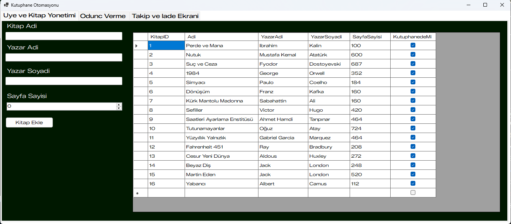
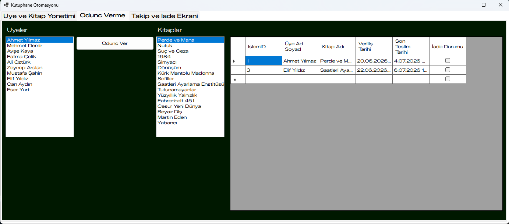
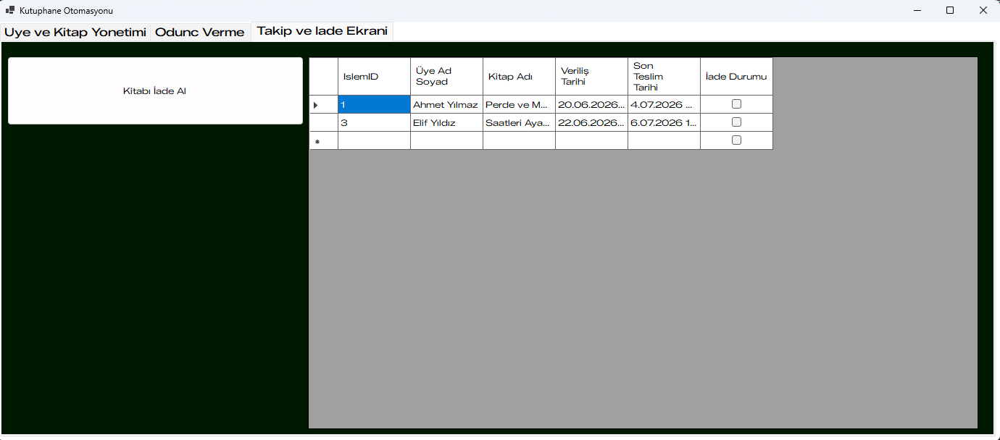

# 📚 Kütüphane Otomasyon Sistemi

Bu proje; kitapların, üyelerin ve ödünç alma süreçlerinin yönetimini dijitalleştirmek amacıyla geliştirilmiş, ilişkisel veritabanı destekli bir masaüstü otomasyon sistemidir.

## 🚀 Özellikler
* **Gelişmiş CRUD Operasyonları:** Kitap, üye ve personel bilgilerini ekleme, silme, güncelleme ve listeleme işlemleri.
* **İlişkisel Veritabanı Mimarisi:** Ödünç alınan kitaplar ile üyeler arasında veritabanı düzeyinde (Foreign Key) dinamik ilişki yönetimi.
* **Stok ve Takip Sistemi:** Hangi kitabın kimde olduğunu, teslim tarihlerini ve anlık stok durumunu takip edebilme.
* **Dinamik Arama/Filtreleme:** Tablolardaki veriler arasında harf bazlı anlık arama yapabilme.

## 🛠️ Kullanılan Teknolojiler
* **Dil:** C# (.NET Framework / WinForms)
* **Veritabanı:** Microsoft SQL Server (MSSQL)
* **Veri Bağlantısı:** ADO.NET
* **IDE:** Visual Studio 2026 / SQL Server Management Studio (SSMS)

## 🗄️ Veritabanı Kurulumu
Projenin çalışabilmesi için gerekli olan MSSQL veritabanı şeması (Script dosyası) proje klasöründeki `kutuphane_db.sql`  dosyasında yer almaktadır. SQL Server'da bu scripti çalıştırarak veritabanını otomatik oluşturabilirsiniz.

## 📸 Ekran Görüntüleri

### Üye Yönetim Paneli

### Ödünç Alma ve Teslim İşlemleri

### Takip ve Iade Ekrani

